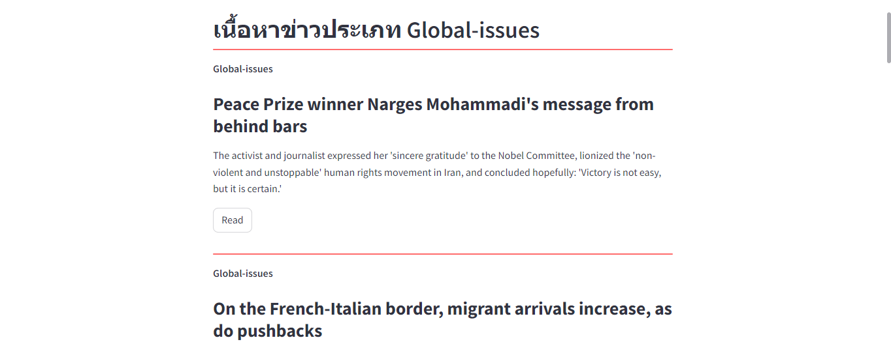

# Scrapy-and-recommned-news

### วิธีการใช้งาน

1. ทำการเปิด cmd แล้วเข้าถึงโฟล์เดอร์ที่จะเก็บโปรเจ็ค Ex: cd 'path/to/your/directory'
2. ทำการ git clone https://github.com/alexday11/Scrapy-and-recommned-news.git
3. cd 'Scrapy-and-recommned-news'
4. pip install -r requirements.txt
5. สามารถเริ่ม แอปโดยใช้คำสั่ง streamlit run app.py

